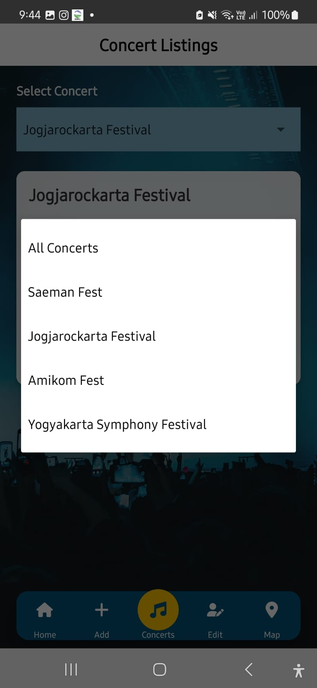

# 

---

**Nada Pradipa** adalah aplikasi yang hadir untuk menerangi perjalanan musikal, dirancang untuk memudahkan pecinta musik di Yogyakarta menemukan informasi tentang konser yang akan datang. Nama "Nada Pradipa" menggabungkan dua unsur, yaitu "Nada" yang mewakili musik dan "Pradipa" yang berarti cahaya, mencerminkan tujuan aplikasi ini untuk memudahkan pengguna untuk menemukan informasi konser, menjelajahi jadwal, dan mengetahui lokasi acara, dan menjadikan setiap momen musik di kota budaya ini lebih berarti dan mudah diakses.

---

## Komponen Pembangun Produk

- **React Native**: Membangun aplikasi mobile dengan kode yang sama.
- **React Navigation**: Mengelola navigasi antar layar dengan tab navigasi.
- **JSON Server**: Menyediakan backend untuk simulasi penyimpanan data dan API endpoint.
- **CRUD Operasi**: Menambah, membaca, mengedit, dan menghapus data.
- **WebView**: Menampilkan peta konser dari URL.
- **Alert Dialog**: Konfirmasi saat menyimpan atau menghapus data.
- **StyleSheet**: Menentukan tampilan visual komponen aplikasi.
- **Leaflet.js**: Menampilkan peta interaktif dalam aplikasi.
- **Ionic**: Membangun aplikasi mobile dengan tampilan yang konsisten.
- **Vercel**: Platform hosting yang digunakan untuk menyebarkan aplikasi web.

---

## Sumber Data

- **Sosial Media**: Informasi konser yang dibagikan melalui platform media sosial seperti Instagram atau Twitter, yang sering digunakan penyelenggara acara untuk mengumumkan jadwal dan detail konser.
- **Website Resmi**: Data konser yang diperoleh dari situs web penyelenggara atau penjualan tiket yang menyediakan jadwal resmi dan informasi terkait.

---

## Tangkapan Layar Komponen Produk

| Home 1  | Home 2  | Add 1  |
|---------|---------|--------|
|  |  |  |

| Add 2   | List 1  | List 2 |
|---------|---------|--------|
|  |  |  |

| Edit    | Map 1   | Map 2  |
|---------|---------|--------|
|  |  |  |

---

## Demonstrasi

Berikut adalah demonstrasi produk. Klik link ini untuk menonton:
[https://youtube.com/shorts/dZYIRblTQDc](https://youtube.com/shorts/dZYIRblTQDc)

---